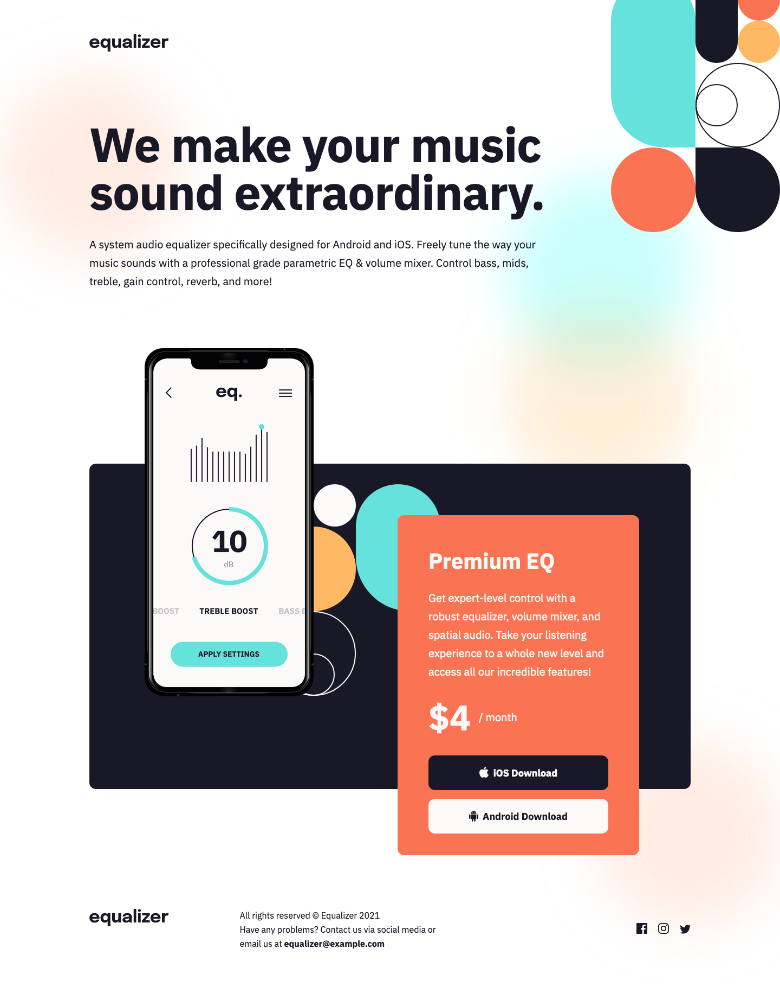

# Equalizer landing page solution

This is a solution to the [Equalizer landing page challenge on Frontend Mentor](https://www.frontendmentor.io/challenges/equalizer-landing-page-7VJ4gp3DE).

## Table of contents

-   [Screenshot](#screenshot)
-   [Links](#links)
-   [Built with](#built-with)
-   [Author](#author)

## Screenshot

## Links

-   [Solution URL](https://github.com/ionStici/equalizer-landing-page)
-   [Live Site URL](https://ionstici.github.io/equalizer-landing-page)

## Built with

-   Semantic HTML5 markup
-   CSS custom properties
-   Flexbox and CSS Grid

## Author

-   [GitHub](https://github.com/ionStici)
-   [Frontend Mentor](https://www.frontendmentor.io/profile/ionStici)

<!-- #### Text

-   Very dark desaturated blue: hsl(238, 29%, 16%)
-   Soft red: hsl(14, 88%, 65%)

#### Gradient

Background gradient:

-   Soft violet: hsl(273, 75%, 66%)
-   Soft blue: hsl(240, 73%, 65%)

#### Text

-   Very dark grayish blue: hsl(237, 12%, 33%)
-   Dark grayish blue: hsl(240, 6%, 50%)

#### Dividers

-   Light grayish blue: hsl(240, 5%, 91%)

-   Font size: 12px
-   Family: [Kumbh Sans](https://fonts.google.com/specimen/Kumbh+Sans)
-   Weights: 400, 700 -->
